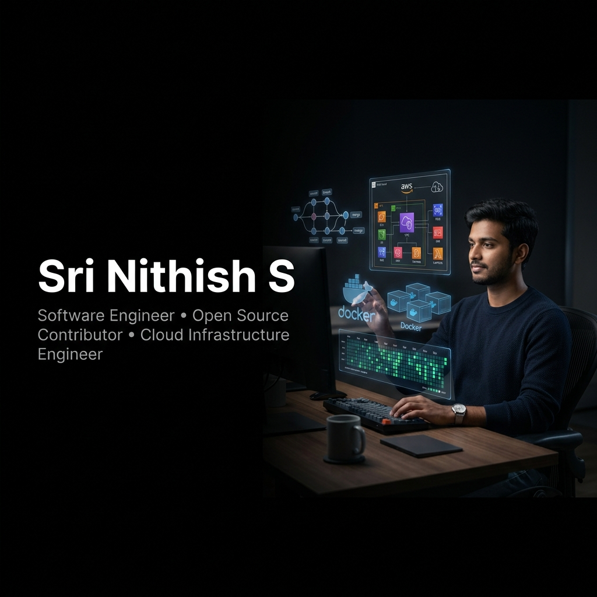

# Sri Nithish S

  

 

  <h3>Software Engineer • Open Source Contributor • Cloud Infrastructure Engineer</h3>
  
<strong>Building software that solves real-world problems.</strong>

  
Focused on building scalable systems, contributing to open source, and learning in public.

---

### 🌌 Visualizing the Journey

From local development to cloud production, I architect end-to-end solutions that scale. I believe in open collaboration, testing in public, and building clean, reproducible infrastructure.

- 🔭 **Learning & Building**: Designing real-time automation systems and modern web interfaces.
- ⚙️ **Automation & DevOps**: Writing workflows to automate pull requests, testing, and continuous deployment.
- ☁️ **Infrastructure & Architecture**: Coordinating backend APIs, database nodes, and cloud topologies.

---

### 📂 Featured Projects & Open Source contributions

Based on analysis of my public GitHub profile, here are some of the key repositories and open-source contributions I work on:

* 📱 **[DeoHealth](https://github.com/srinithishs004/DeoHealth)**: Fitness tracking Android mobile application developed in Kotlin.
* ⚙️ **[airflow](https://github.com/srinithishs004/airflow)** (Fork/Contributor): Apache Airflow platform for orchestrating and programmatically scheduling workflows.
* 🔄 **[n8n](https://github.com/srinithishs004/n8n)** (Fork/Contributor): Fair-code workflow automation engine with AI node extensions.
* 🏡 **[home-assistant.io](https://github.com/srinithishs004/home-assistant.io)** (Fork/Contributor): Dynamic open-source smart-home user documentation.
* 📊 **[mermaid](https://github.com/srinithishs004/mermaid)** (Fork/Contributor): Markdown-inspired text-to-diagram rendering engine.

---

### 🛠️ Core Technologies & Ecosystem

<table align="center" border="0" cellpadding="5">
  <tr>
    <td align="left" valign="top" width="33%">
      <strong>Languages & Frameworks</strong> 
       
       
       
      
    </td>
    <td align="left" valign="top" width="33%">
      <strong>Cloud & Infrastructure</strong> 
       
       
       
      
    </td>
    <td align="left" valign="top" width="33%">
      <strong>Workflow & Collaboration</strong> 
       
       
       
      
    </td>
  </tr>
</table>

---

### 📊 Live Profile Metrics

<!-- START_SECTION:dynamic_stats -->
- 🌌 **Total Contributions**: **33** (in the last year)
- 📂 **Public Repositories**: **17**
- 👥 **Followers**: **2**
- 🤝 **Following**: **0**
<!-- END_SECTION:dynamic_stats -->

---

### 📈 Contribution & System Activity

  

 

  
  &nbsp;&nbsp;
  

 

  

---

### ⚡ Recent GitHub Activity

<!-- START_SECTION:activity -->
<!-- END_SECTION:activity -->

---

### 🤝 Connect & Collaborate

- 🌐 **Portfolio / Blog**: [srinithishs.qzz.io](https://srinithishs.qzz.io/)
- 💼 **LinkedIn**: [linkedin.com/in/srinithishs](https://linkedin.com/in/srinithishs)
- ✉️ **Email**: [contact@srinithish.dev](mailto:contact@srinithish.dev)

 

  Designed with a futuristic, minimalistic developer aesthetic. Base-black #000000 theme.

