# Sri Nithish S

  

 

  <h3>Cloud Infrastructure Engineer &amp; Full-Stack Developer</h3>
  
<strong>Building software that solves real-world problems.</strong>

  
Focused on building scalable systems, contributing to open source, and learning in public.

---

### 🌌 Visualizing the Journey

I am a Software Engineer and Computer Science graduate who builds across the full technology stack. My work ranges from backend development with Python and Node.js to cloud infrastructure on AWS, mobile applications, modern web experiences, and intelligent connected systems.

- 💼 **Current Role**: Cloud Infrastructure Engineer &amp; Full-Stack Developer at **TOTEX ENERGY**.
- 🔭 **Current Focus**: Designing real-time automation systems, IoT telemetry pipelines, and scalable APIs.
- ⚙️ **Philosophy**: Great software isn't defined by a single technology — it's about understanding how all pieces work together, from user interfaces and APIs to cloud services and real-world devices.

---

### 🤝 Open Source Contributions

I believe in open collaboration and learning in public. Here are some of the open-source ecosystems I've contributed to or worked within:

* 📱 **[Paper Cups](https://github.com/papercups-io/papercups)**: Contributed to community-driven React/frontend tasks to improve UI components and user experiences.
* 🎨 **[Penpot](https://github.com/penpot/penpot)**: Explored design systems and open-source prototyping platforms to implement clean design-to-development workflows.
* 🏡 **[Home Assistant](https://github.com/home-assistant/core)**: Contributed to smart home integration architectures, event-driven automations, and Python-based IoT patterns.
* 🔄 **[n8n](https://github.com/n8n-io/n8n)**: Developed workflow automations, integrated REST APIs, and configured low-code orchestration flows in Node.js.

---

### 📈 System Metrics &amp; Contribution Activity

  

 

  
  &nbsp;&nbsp;
  

 

  

---

### 📊 Live Profile Metrics

<!-- START_SECTION:dynamic_stats -->
- 🌌 **Total Contributions**: **43** (in the last year)
- 📂 **Public Repositories**: **17**
- 👥 **Followers**: **2**
- 🤝 **Following**: **0**
<!-- END_SECTION:dynamic_stats -->

---

### ⚡ Recent GitHub Activity

<!--START_SECTION:activity-->
1. 💪 Opened PR [#32711](https://github.com/n8n-io/n8n/pull/32711) in [n8n-io/n8n](https://github.com/n8n-io/n8n)
2. 🗣 Commented on [#32711](https://github.com/n8n-io/n8n/pull/32711#issuecomment-4761190686) in [n8n-io/n8n](https://github.com/n8n-io/n8n)
<!--END_SECTION:activity-->

---

### 🤝 Connect &amp; Collaborate

- 🌐 **Portfolio &amp; Blog**: [srinithishs.qzz.io](https://srinithishs.qzz.io/)
- 💼 **LinkedIn**: [linkedin.com/in/srinithishs](https://linkedin.com/in/srinithishs)
- ✉️ **Email**: [srinithishs004@gmail.com](mailto:srinithishs004@gmail.com)

 

